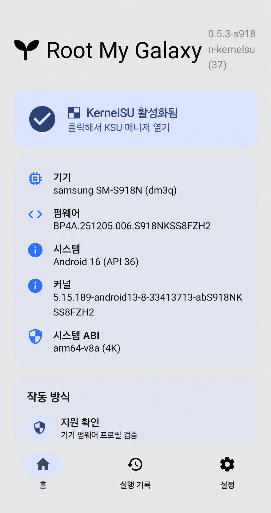
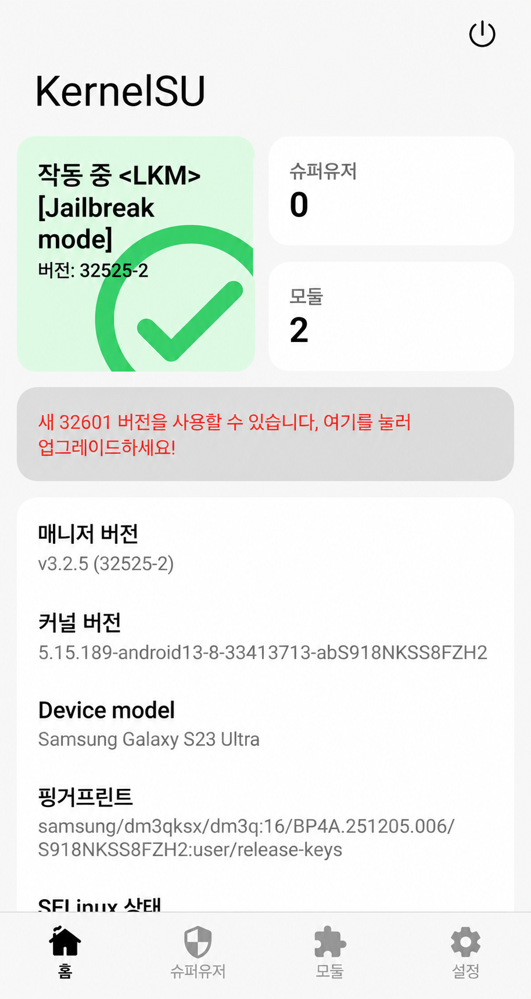

# Root My Galaxy SM-S918N

SM-S918N-only Root My Galaxy port for the exact Korean FZH2 firmware profile.
The app uses the official KernelSU userspace contract and refuses every other
model, build, fingerprint, or kernel version.

[Releases](https://github.com/trick21sh/Root-My-Galaxy-SM-S918N/releases) ·
[FZH2 target](docs/TARGET_SM_S918N_FZH2.md) ·
[Official KernelSU](https://github.com/tiann/KernelSU)

## Screenshots

| Root My Galaxy | KernelSU |
| --- | --- |
|  |  |

## Exact supported target

```text
model: SM-S918N
device: dm3q
build display: BP4A.251205.006.S918NKSS8FZH2
fingerprint: samsung/dm3qksx/dm3q:16/BP4A.251205.006/S918NKSS8FZH2:user/release-keys
kernel release: 5.15.189-android13-8-33413713-abS918NKSS8FZH2
kernel build: #1 SMP PREEMPT Tue Aug 11 06:15:40 UTC 2026
```

Only the exact FZH2 profile is bundled.

## KernelSU

The bundled late-load userspace is the Samsung-targeted official KernelSU
v3.2.5 build. The APK opens the official Manager package
`me.weishu.kernelsu` and checks KernelSU activation through the official
driver `ioctl`/legacy `prctl` protocol, not by looking for a different
package or merely checking a filesystem path.

## Safety

The exploit and late-load path can reboot the phone on an incompatible or
unstable target. Use only on hardware you own or are authorized to test, keep
the exact FZH2 stock firmware ready for recovery, and do not retry after a
kernel panic without collecting logs.

## Build

```powershell
.\\gradlew.bat test :app:assembleRelease --no-daemon
```

The release APK is unsigned by Gradle; sign it with your own key before
distribution. The project test APK is not an official KernelSU release.

## Important files

```text
app/src/main/assets/targets-v3.json
app/src/main/assets/cve-2026-43499-app-s918n-fzh2.so
app/src/main/assets/ksud-kernelsu-s918n-fzh2
app/src/main/assets/libcve43499root-s918n-fzh2.so
RootMyGalaxyDesktop/assets/profiles.json
tools/f731u-to-dm3q-s918n-fzh2.spec.json
```
